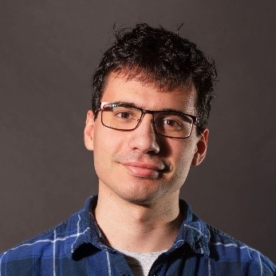

Doktorandusz hallgató a BME Szilárdságtani és Tartószerkezeti Tanszéken, a műszaki textíliák tönkremenetelét vizsgálja.

 <table class="picture">
<tr>
<td>

    
  
Karádi Dániel

</td>
</tr>
</table>
