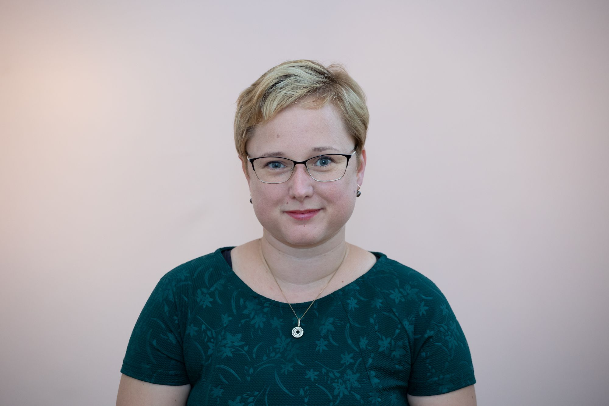

„2009-ben végeztem, a Debreceni Egyetem Bölcsészettudományi Karán, mint történelem-földrajz szakos tanár.
2011-ben a Debreceni Egyetem, Humán Tudományok Doktori Iskolájának, Nevelés- és művelődéstudományi programjában kezdtem meg doktori tanulmányaimat, amit 2014-ben sikeresen abszolváltam. Kutatási témám, a Horthy-korszak oktatáspolitikája, ezen belül a Református Egyházhoz tartozó gimnáziumok tehetségmentő munkája. 
A tanulmányaim alatt, fontosnak tartottam, hogy ne szakadjak el a gyakorlati tanítástól. Így az Osztrák-Magyar Európaiskolában, mint napközis nevelő 10 éves gyerekekkel foglalkoztam, ezt követően a META-Don Bosco Tehnikumban folytattam oktatási tevékenységemet. Párhuzamosan a Debreceni Egyetemen, a Budapesti Gazdasági Egyetemen és a Wesley János Lelkészképző Főiskolán tartottam előadásokat és szemináriumokat.
A tanári hivatást választottam. Elhatározásomban, a családi tradíciók és a belső motivációk vezettek.  Vallom: „A pedagógus és a diák kapcsolatának a kölcsönösségen kell alapulnia: aki megköveteli, hogy köszönjenek neki, annak fogadnia kell a köszönést…, aki azt kívánja tiszteljék diákjai annak tisztelni kell diákjait…, aki azt akarja, hogy diákjai a tökéletesedés útján járjanak, annak magának is el kell indulnia ezen az úton…, aki azt akarja, hogy tanítványai jól érezzék magukat az iskolában, annak jól kell éreznie magát kollégái és diákjai között.” (Kerékgyártó Imre)

 <table class="picture">
<tr>
<td>

    
  
Dr. Kattein-Pornói Rita

</td>
</tr>
</table>