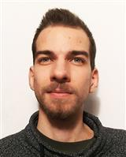

Villamosmérnök, a BME Automatizálási és Alkalmazott Informatikai Tanszékének munkatársa. Szakterülete a beágyazott rendszerek és a robotika érintik, hardveres hangsúllyal.

<table class="picture">
<tr>
<td>

    
  
Kiss Ágoston

</td>
</tr>
</table>
