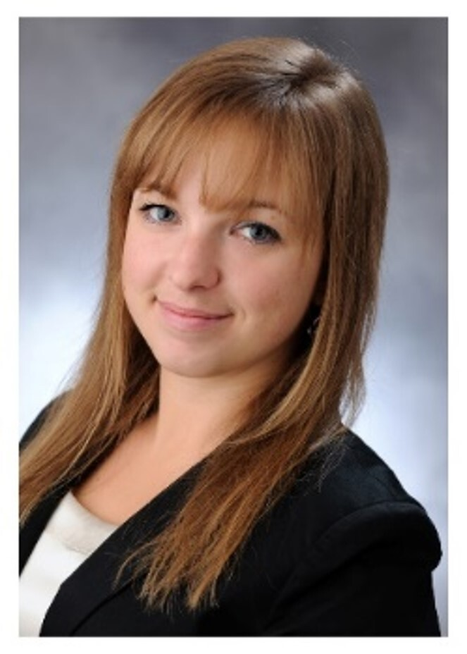

Dr. Kiss Bernadett tanársegéd 2012-ben szerzett MSc diplomát a Budapesti Műszaki és Gazdaságtudományi Egyetemen Alkalmazott Biotechnológia szakirányon. 2012-ben kezdte meg tanulmányait PhD hallgatóként az Alkalmazott Biotechnológia és Élelmiszertudományi Tanszéken, majd 2015-től tudományos segédmunkatársként vesz rész a Fermentációs Félüzem munkáiban, 2024-ben szerzett PhD fokozatot. Kutatási területe a mikroalga fermentációk vizsgálata, léptéknövelése és modellezése.

*She graduated in 2012 as a bioengineer (MSc) at Budapest University of Technology and Economics, Applied Biotechnology. Since 2012 she studies as a PhD student at the Department of Applied Biotechnology and Food Science, then she is working as a research assistant with Fermentation Pilot Plant group since 2015. Her area of research is microalgae fermentation examination, scale up and modelling.*

<table class="picture">
<tr>
<td>

    
  
Kiss Bernadett

</td>
</tr>
</table>
