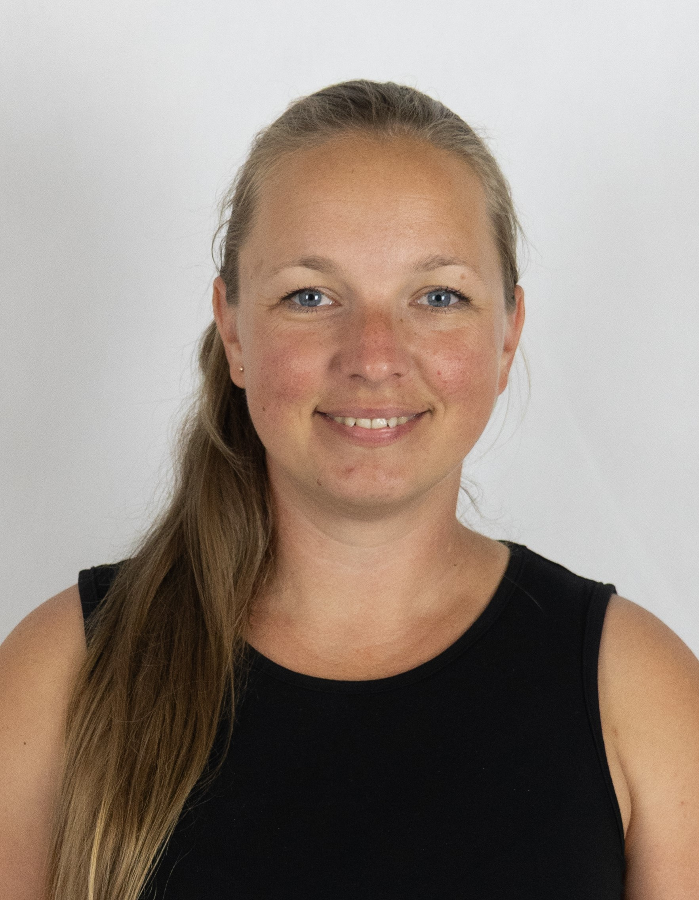

Alkalmazott Biotechnológia szakirányon 2012-ben szerzett MSc biomérnök diplomát a Budapesti Műszaki és Gazdaságtudományi Egyetemen, majd ugyan ebben az évben megkezdte PhD tanulmányait az Alkalmazott Biotechnológia és Élelmiszertudományi Tanszéken. Munkatársként 2015 óta vesz részt a Fermentációs Félüzem munkáiban, 2024-ben szerzett PhD fokozatot és jelenleg adjunktusként dolgozik. Kutatási területe a mikroalga fermentációk vizsgálata, léptéknövelése és modellezése. 

She graduated in 2012 as a bioengineer (MSc) at Budapest University of Technology and Economics, Applied Biotechnology, she starded the PhD studies at Department of Applied Biotechnology and Food Science in the same year. Then she is working with Fermentation Pilot Plant group since 2015, obtained her PhD degree in 2024 and currently works as an assistant professor. Her area of research is microalgae fermentation examination, scale up and modelling

<table class="picture">
<tr>
<td>

    
  
Kiss Bernadett

</td>
</tr>
</table>
