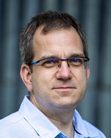

Villamosmérnök, a BME Automatizálási és Alkalmazott Informatikai Tanszékének adjunktusa. 2008 óta egyetemi oktató a beágyazott rendszerek és a robotika területén. 
Kutatási területe a mobilis robotok mozgástervezése és irányítása.

<table class="picture">
<tr>
<td>

    
  
Kiss Domonkos

</td>
</tr>
</table>
