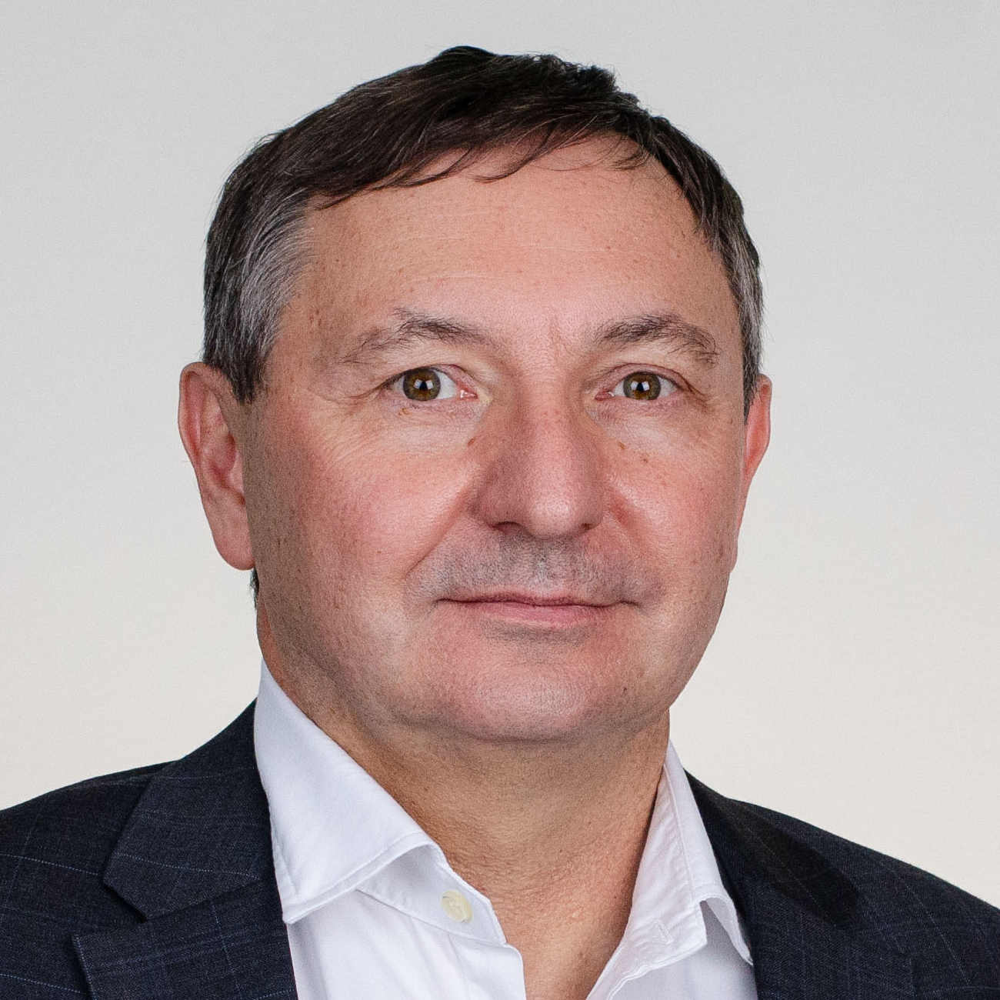

1990-ben végzett a BME-n villamosmérnökként, majd 2006-ban szerzett MBA diplomát szintén a BME-n. Az egyetem elvégzése után az informatikai szektorban és a távközlésben dolgozott, felsővezetői és tanácsadói pozíciókban. 2018 Március óta a BME Ipar4.0 Technológiai Központ vezetője, ahol elsősorban a magyar KKV szektort segíti a digitalizációs projekteben, ehhez kapcsolódóan több kutatás-fejlesztési projektben dolgozik.

 <table class="picture">
<tr>
<td>

    
  
Kovács László

</td>
</tr>
</table>
