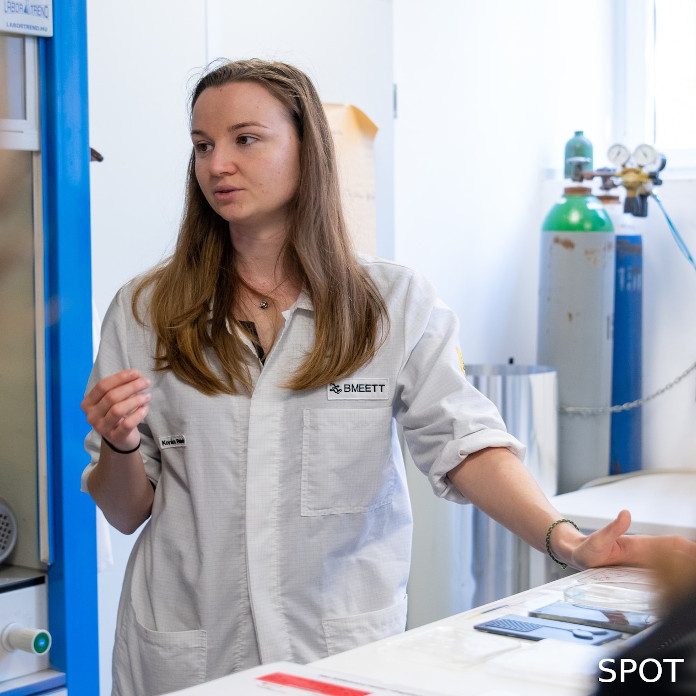

A BME VIK Elektronikai Technológia Tanszék PhD hallgatója. Biomérnöki BSc és Egészségügyi mérnöki MSc végzettséggel rendelkezik. Doktori kutatásának témája a lokalizált felületi plazmonrezonancián alapuló bioszenzorok fejlesztése. 

<table class="picture">
<tr>
<td>

    
  
Kovács Rebeka

</td>
</tr>
</table>
