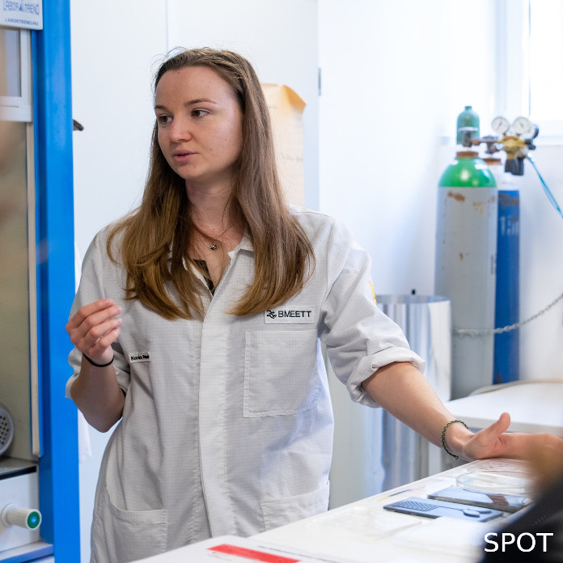

A BME VIK Elektronikai Technológia Tanszék doktorjelöltje. Biomérnöki BSc és Egészségügyi mérnöki MSc végzettséggel rendelkezik. Doktori disszertációját a lokalizált felületi plazmonrezonancián alapuló bioszenzorok fejlesztéséről írta.  

<table class="picture">
<tr>
<td>

    
  
Kovács Rebeka

</td>
</tr>
</table>
