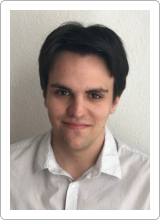

Okleveles gépészmérnök (MSc), jelenleg doktoranduszként dolgozik a HDR Tanszéken. Fő kutatási területét a szonokémiai kutatások (buborék dinamika).

<table class="picture">
<tr>
<td>

    
  
Krähling Péter

</td>
</tr>
</table>
