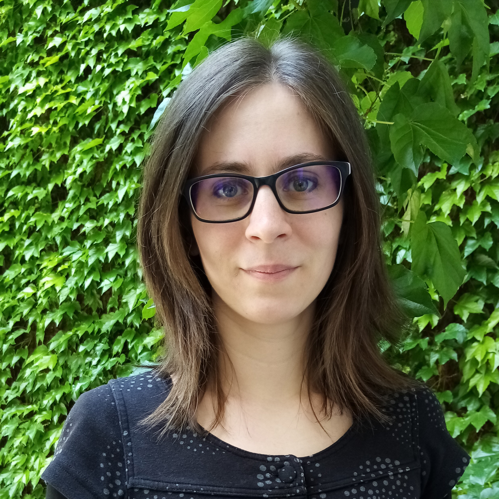

2018-tól a BME Kognitív Tudományi Tanszék tudományos segédmunkatársa. Kutatási területe a nyelvelsajátítás pragmatikai vetülete: arról szeretne minél többet megtudni, hogy mikor és milyen képességek birtokában tanuljuk meg a nyelv olyan szabályait, amelyek nem a nyelvtanból következnek.

 <table class="picture">
<tr>
<td>

    
  
Krizsai Fruzsina

</td>
</tr>
</table>
