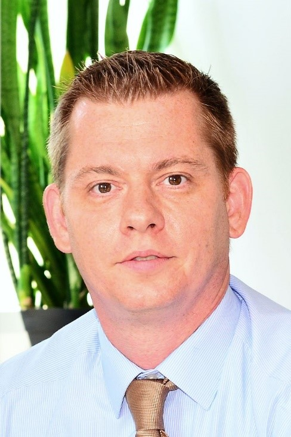

Kun Róbert vagyok, végzettségem vegyész és kémia tanár. A doktori fokozat megszerzése után kutatóként helyezkedtem el. Posztdoktorként és kutatócsoport vezetőként közel 10 évet töltöttem Németországban, ahol megkezdtem az újgenerációs, elsősorban szilárdtest Li-ion akkumulátorokhoz kapcsolódó kutatásaimat. Jelenleg az ELKH Természettudományi Kutatóközpontban dolgozom, mint kutatócsoport vezető, valamint a BME Vegyészmérnöki és Biomérnöki Kar (VBK) oktatójaként is tevékenykedem. Fő kutatási területem az újgenerációs Li-ion akkumulátor elektród és elektrolit anyagainak, valamint mechanikailag hajlítható akkumulátorok fejlesztése és vizsgálata.

 <table class="picture">
<tr>
<td>

    
  
Dr. Kun  Róbert

</td>
</tr>
</table>
