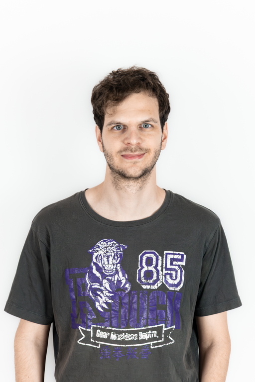

ELTE biológia alapképzés és BME biomérnök mesterszak után jelenleg a Biokémia és Molekuláris Biológia Kutatócsoport tagjaként végzem a PhD-m. 
A fő kutatási témáim a sejthalál folyamatok, citotoxikológiai vizsgálatok és ipari fehérje termelés. 

 <table class="picture">
<tr>
<td>

    
  
Kurucz Bálint

</td>
</tr>
</table>
