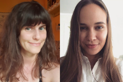

AAz előadók a Neuropszichológia és Megismerés kutatócsoport tagjai. A kutatócsoport vezetője Dr. Demeter Gyula, habilitált egyetemi docens és neuropszichológus. Lencsés Anita és Mikula Bernadett pszichológusok és harmadéves doktoranduszok. Érdeklődésük középpontjában az agysérülést követő emlékezeti és társas-érzelmi nehézségek állnak. Fontosnak gondolják, hogy a kutatási eredményeik a neuropszichológiai gyakorlati munkában is alkalmazhatóak legyenek

 <table class="picture">
<tr>
<td>

    
  
Lencsés Anita és Mikula Bernadett

</td>
</tr>
</table>
