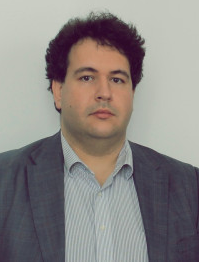

[Dr. Lőrincz Viktor](https://jog.tk.hu/kutato/lorincz-viktor) művészettörténész diplomáját az ELTE-n, jogi diplomáját az ELTE-n és a Paris 1 Panthéon-Sorbonne egyetemeken, gazdaságpszichológus diplomáját a Paris 5 Descartes egyetemen szerezte, a Társadalomtudományi Kutatóközpont tudományos segédmunkatársa és a Magyar Tudományos Akadémia Művészeti Gyűjteményének tudományos munkatársa, az Acta Juridica - Hungarian Journal of Legal Studies felelős társszerkesztője. A francia kormány, az Île-de-France régió, a Magyar Állami Eötvös Ösztöndíj, a Sasakava Young Leader Fellowship, és az Ernst Mach Stipendium ösztöndíjasa volt. Publikációi jelentek meg angol, francia, német és magyar nyelven.

<table class="picture">
<tr>
<td>

    
  
Dr. Lőrincz Vikto

</td>
</tr>
</table>
