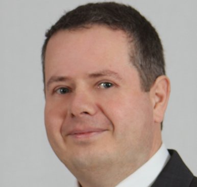

BME Közlekedésmérnöki és Járműmérnöki Karán szerzett diplomát járműgépész szakirányon. PhD címét a gépjármű sebességváltók kapcsolhatósága témában szerezte. Jelenleg a BME Vasúti Járművek és Járműrendszeranalízis Tanszék docense. Több éve foglalkozik koponya implantátumok tervezésével.

 <table class="picture">
<tr>
<td>

    
  
Dr Lovas László

</td>
</tr>
</table>