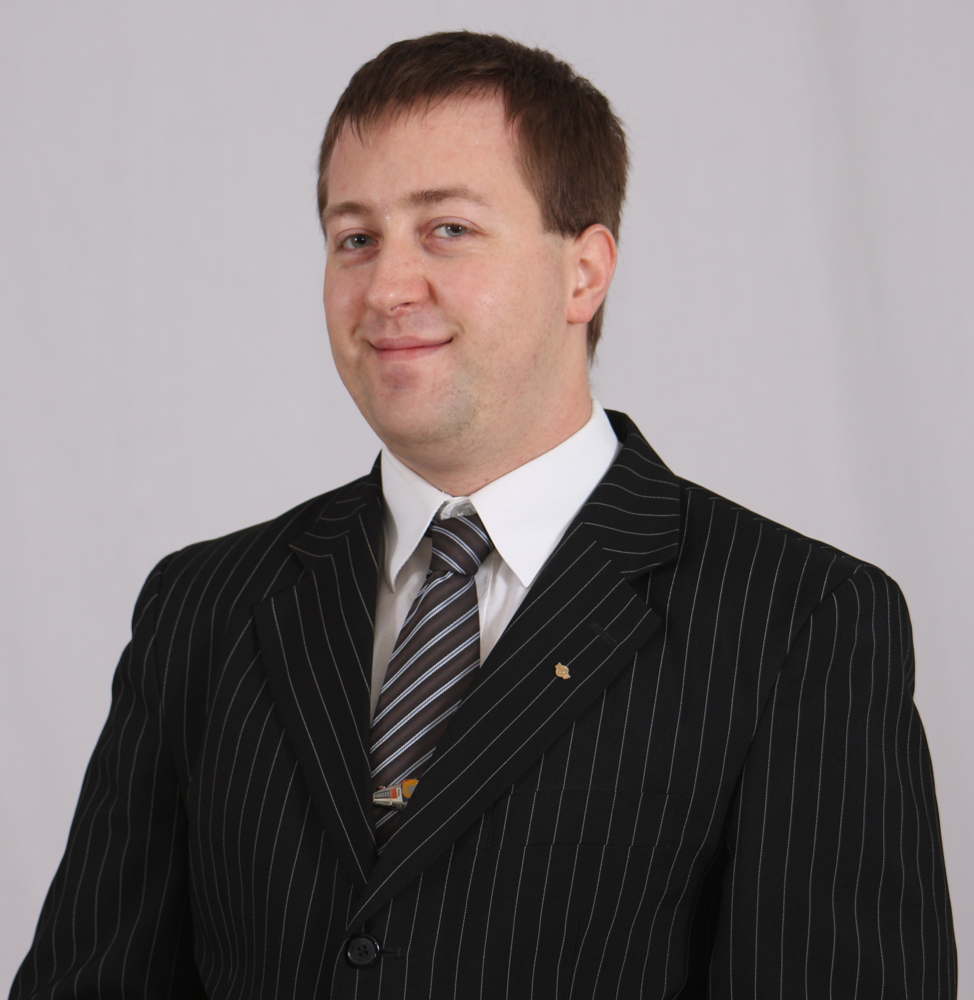

Lövétei István Ferenc már gyerekkorától a vasúti közlekedés megszállottja, ezt mutatja a több mint 10 éves önkéntes tevékenysége a Gyermekvasúton. Ezzel párhuzamosan végezte Bsc majd Msc tanulmányait a BME Közlekedésmérnöki és Járműmérnöki Karán, ahol jelenleg tudományos segédmunkatársi pozícióban dolgozik. Kutatási területe elsősorban a vasúti forgalomirányítás hatékonyságának növelése, automatizált forgalomlebonyolódási eljárások vizsgálata, azok alkalmazhatóságának elemzése. Oktatási tevékenysége elsősorban a vasúti jelző-és irányítórendszerekhez kapcsolódó tárgyakhoz kapcsolódik, egészen az alapozó tárgyaktól kezdve a mesterképzés közlekedésautomatizálási szakirányáig. Egyetemi munkája mellett jelenleg a BME-ITS megfelelőségértékelő szervezet munkatársaként részt vesz a hazai vasúti projektek DeBo, NoBo és AsBo eljárásaiban, valamint hazai biztosítóberendezési területen, mint független biztonságértékelő - ISA - szerepben is dolgozik.

<table class="picture">
<tr>
<td>

    
  
Lövétei István Ferenc

</td>
</tr>
</table>
