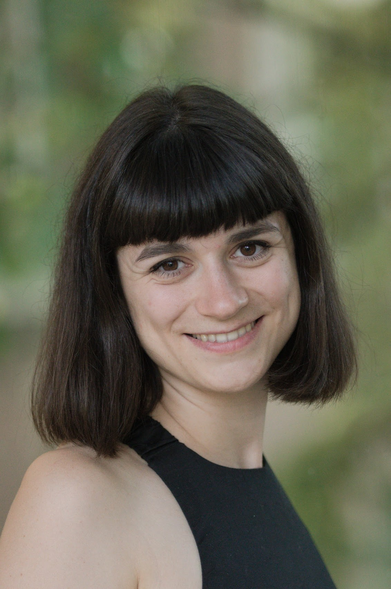

Lukics Krisztina Sára pszichológus, a BME Kognitív Tudományi Tanszék adjunktusa. Kutatási érdeklődésének fókkuszában az áll, hogy a nem csak a nyelvet alátámasztó, általános megismerőfunkciók hogyan alakítják a nyelvhasználat képességét.

<table class="picture">
<tr>
<td>

    
  
Lukics Krisztina Sára /div>

</td>
</tr>
</table>
