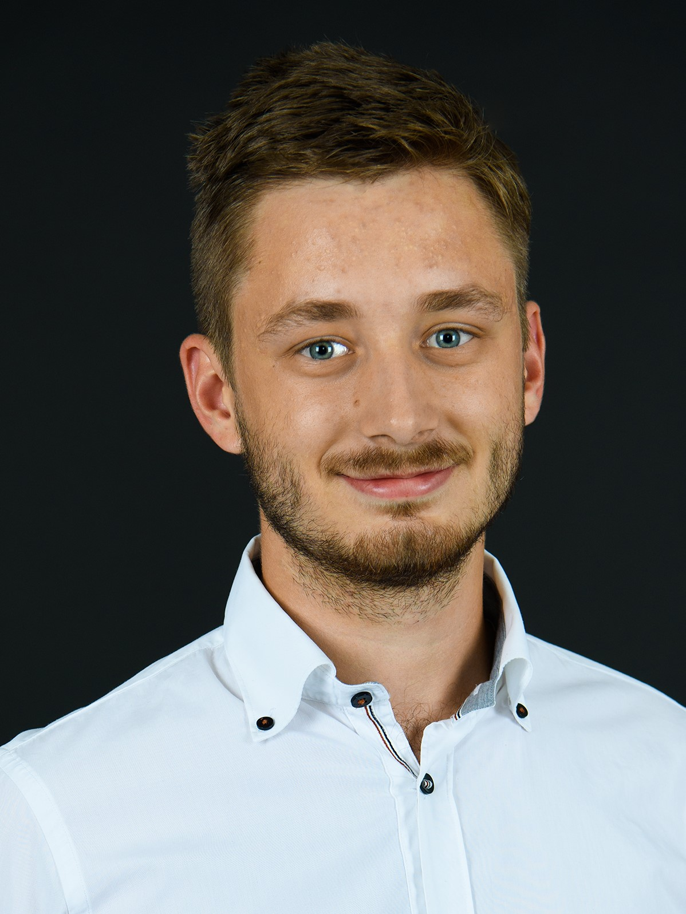

BME Kozmosz Kör alelnöke, villamosmérnök hallgató a Műegyetemen. Hallgatói tevékenységem során volt szerencsém részt venni a SMOG projekt és a BME Kozmosz Kör kollaborációjában, mely eredményeként elkészült az első publikus térkép a Föld körüli rádiófrekvenciás szennyezettségről. 

 <table class="picture">
<tr>
<td>

    
  
Markotics Boldizsár

</td>
</tr>
</table>
