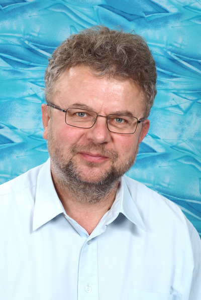

Oktatási munkám az informatikus képzésekre koncentrál, operációs rendszerek és mesterséges intelligencia témájú tantárgyak oktatásában veszek részt. Kutatási területeim: mesterséges intelligencia (intelligens ágensek), szövegelemzés és -bányászat, természetes nyelvű felhasználói felületek, valamint mindezek alkalmazásai az információszolgáltatásban és beszerzésben.

 <table class="picture">
<tr>
<td>

    
  
Mészáros Tamás Csaba

</td>
</tr>
</table>
