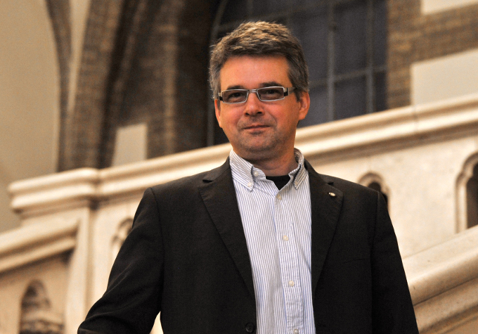

Mika László Tamás, egyetemi tanár, tanszékvezető, vegyészmérnök oklevelét 2000-ben a Veszprémi Egyetemen, summa cum laude minősítésű Ph.D fokozatát 2010-ben az ELTE-n szerezte. 2012-től óta BME, VBK, Kémiai és Környezeti Folyamatmérnöki Tanszékének oktatója, a Katalitikus Eljárások Kutatócsoportot vezetője. Kutató évei során több külföldi intézményben (Forschungszentrum Karlsruhe, BayerMaterialScience Leverkusen, City University of Hong Kong) dolgozott vendégkutatóként.
Főbb kutatási területei a homogén katalízis, nagynyomású szintézisek és reakciómechanizmusok vizsgálata, katalizátor-tervezés valamint fázisegyensúlyok mérése és modellezése.

 <table class="picture">
<tr>
<td>

    
  
Dr. Mika László Tamás

</td>
</tr>
</table>
