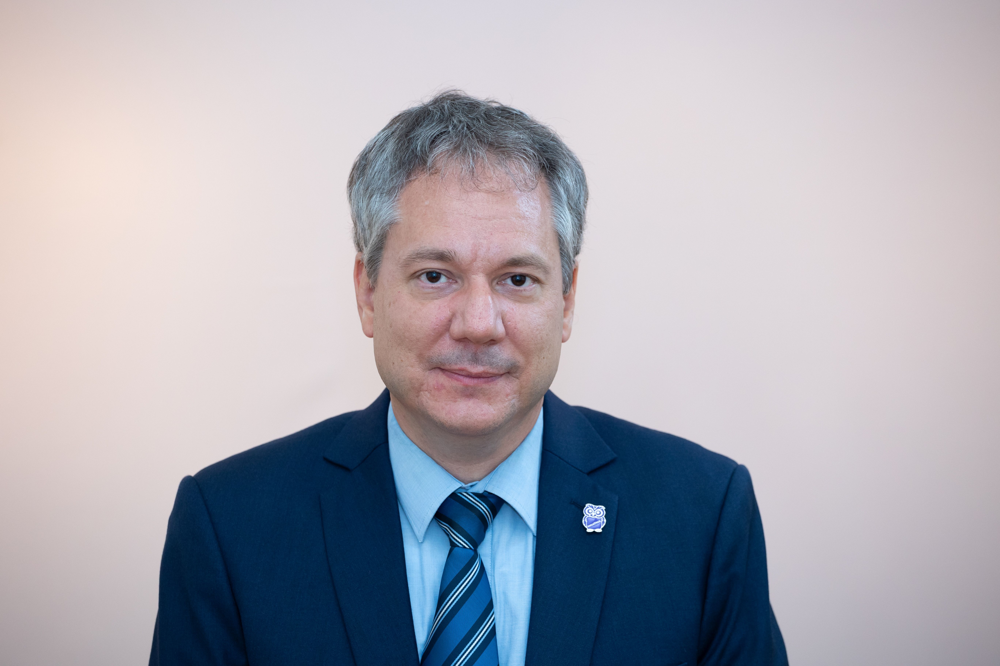

habilitált egyetemi docens, a BME Tanárképző Központ korábbi főigazgatója. Villamosmérnök-mérnöktanár, orvosbiológus mérnök, a Neveléstudomány Doktora (PhD.) közoktatási vezető-szakvizsgázott pedagógus, számos tudományos és szakmai bizottság aktív tagja (OTDT, Tehetség Tanács, MAB, HERA, MPT, TKSZ). Az IKT-alapú kutatási alaptémái mellett a szakképzés-pedagógia módszertani és technológiai-innovációs lehetőségei is foglalkoztatják, melyek alkalmat adtak arra is, hogy az új korszerű, atipikus és elektronikus tanítási-tanulási utakat is kutathassa. MTA Bolyai és ÚNKP Bolyai+ ösztöndíjas, MTA Pedagógiai Tudományos Bizottság tagja. http://www.mpt.bme.hu/dr-molnar-gyorgy/, https://mta.hu/mta_hirei/bolyaisok-molnar-gyorgy-pedagogus-oktataskutato-mernoktanar-111558

 <table class="picture">
<tr>
<td>

    
  
Dr. Molnár György

</td>
</tr>
</table>
