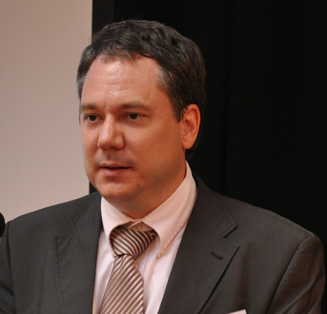

Dr. habil Molnár György, egyetemi docens, a Műszaki Pedagógia Tanszék korábbi tanszékvezetője és a BME Tanárképző Központ korábbi főigazgatója. Villamosmérnök-mérnöktanár, orvosbiológus mérnök, a Neveléstudomány Doktora (PhD.) közoktatási vezető-szakvizsgázott pedagógus, számos tudományos és szakmai bizottság aktív tagja (OTDT, Tehetség Tanács, MAB, HERA, MPT, TKSZ). http://www.mpt.bme.hu/dr-molnar-gyorgy/

2001 óta a BME egyetemi oktatójaként folyamatosan részt vesz a Műszaki Pedagógiai Tanszék valamint a Gazdaság-és Társadalomtudományi Kar munkájában. Az IKT-alapú valamint élménypedagógiai jellegű kutatási alaptémái mellett a szakképzés-pedagógia módszertani és technológiai-innovációs lehetőségei is foglalkoztatták, melyek alkalmat adtak arra is, hogy az új korszerű, atipikus és elektronikus tanítási-tanulási utakat is kutathassa. Email/Ímél: molnar.gy@eik.bme.hu

 <table class="picture">
<tr>
<td>

    
  
Dr. Molnár György

</td>
</tr>
</table>
