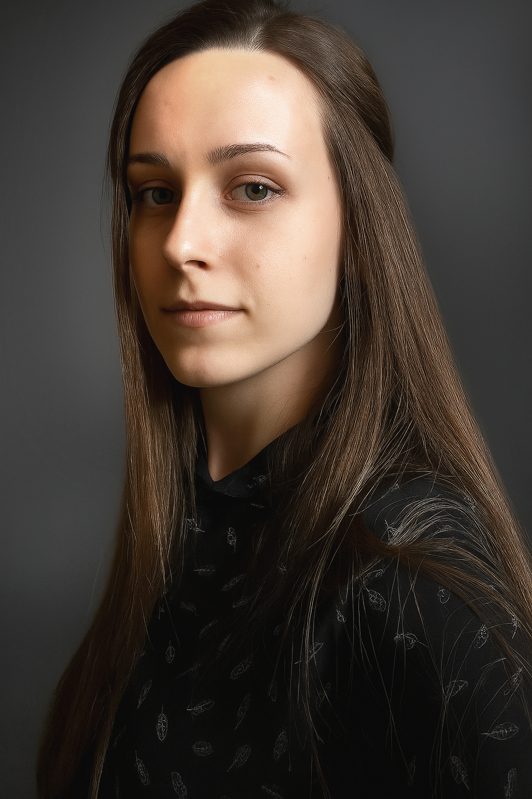

Az Ergonómia és Pszichológia Tanszék PhD hallgatója. Pszichológiai tanulmányai alatt ismerkedett meg a szoftverergonómia tudományágával, és azóta is aktívan kutat a felhasználói élmény (UX) területén. 
Kutatási tevékenységének fókuszában a mesterséges intelligencia (AI) felhasználó-központú fejlesztési folyamatokban betöltött szerepének vizsgálata áll. 

<table class="picture">
<tr>
<td>
 

    
  
Molnár Marietta

</td>
</tr>
</table>
