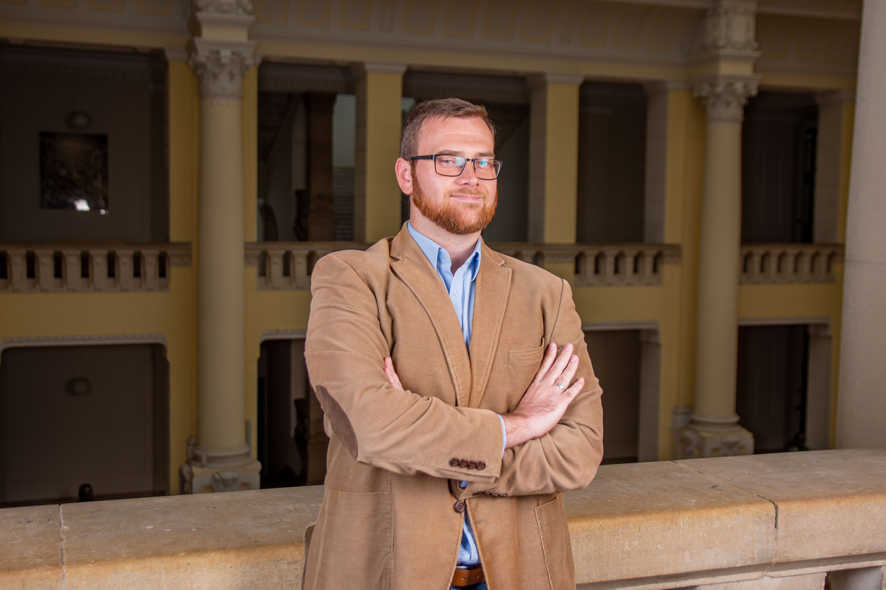

[Murányi Gábor](https://vkkt.bme.hu/muranyi-gabor) okleveles infrastruktúra-építőmérnök, tudományos segédmunkatárs a Vízi Közmű és Környezetmérnöki tanszéken. Kutatási témája alternatív árvízvédelmi megoldások stratégiai lehetőségeinek tudományos megalapozása.

<table class="picture">
<tr>
<td>

    
  
Murányi Gábor

</td>
</tr>
</table>
