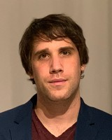

Villamosmérnök, a BME Automatizálási és Alkalmazott Informatikai Tanszékének adjunktusa. 
Érdeklődésének középpontjában elsősorban a robotika, és a beágyazott rendszerek állnak.

<table class="picture">
<tr>
<td>

    
  
Dr. Nagy Ákos

</td>
</tr>
</table>
