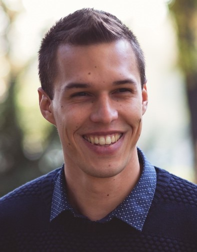

BSc alapképzését biológusként az ELTE-n szerezte, majd MSc mester tanulmányait a Műszaki Egyetemen folytatta alkalmazott biotechnológia szakirányon. A PhD doktori képzést 2017-ben kezdte. Mindösszesen 4 éve vizsgálja az F-laborban a mikroalgák különféle, ipari léptékben is megvalósítható tenyésztéstechnológiáját. Fő érdeklődési körei a mikroalgák mezőgazdasági hasznosíthatósága és a szennyvíztisztításban való alkalmazhatóságuk vizsgálata. Ezenfelül számos algaeredetű biotermék (tápláláékkiegészítők és kozmetikumok alapanyagai) előállításával és kinyerésével is foglalkozik.

He graduated at the University of Science (ELTE) as a biologist, then he continued his studies at the Budapest University of Technology and Economics and specializes in applied biotechnology. He has been started his PhD studies in 2017. In the past 4 years, he has been studying micoralgae culturing techniques and its upscaling processes for industrial applicability in the F-labor. His main interests are the utilization of microalgae in agriculture and their applicability in wastewater treatment. In addition, he is engaged in the production and extraction of a number of algae-based organic products (nutritional supplements and cosmetics raw materials).

 <table class="picture">
<tr>
<td>

    
  
Nagy Balázs József

</td>
</tr>
</table>
