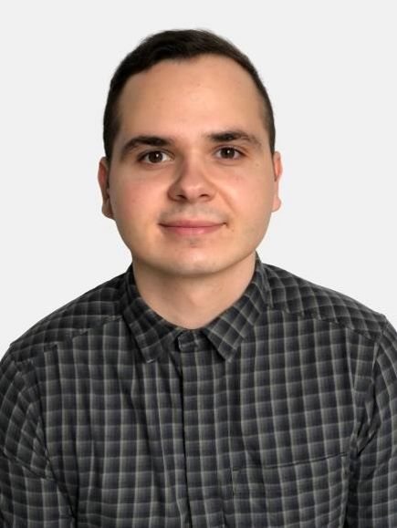

Mechatronikai mérnök, a BME GPK gépészeti modellezés mesterszakos hallgatója. Érdeklődési köre a szimulációs eljárások, szilárdtest mechanika, képelemzés, valamint a szemcsés anyagok keveredésének vizsgálata. _Elérhetősége_: balazs.martin.nagy@gmail.com

<table class="picture">
<tr>
<td>

    
  
Nagy Balázs Martin

</td>
</tr>
</table>
