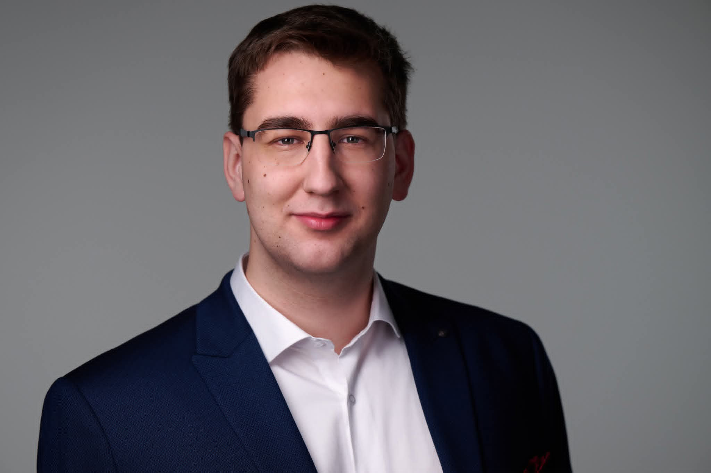

A BME Gazdálkodás- és Szervezéstudományi Doktori Iskolájának harmadéves doktori hallgatója vagyok, és a Filozófia és Tudománytörténet Tanszékhez tartozom. A „Technológiaelméletek” című tárgyat páratlan félévekben műszaki menedzser hallgatóknak tanítom, illetve szabadon választható tárgyként is oktatom.

 <table class="picture">
<tr>
<td>

    
  
Nagy Gellért

</td>
</tr>
</table>
