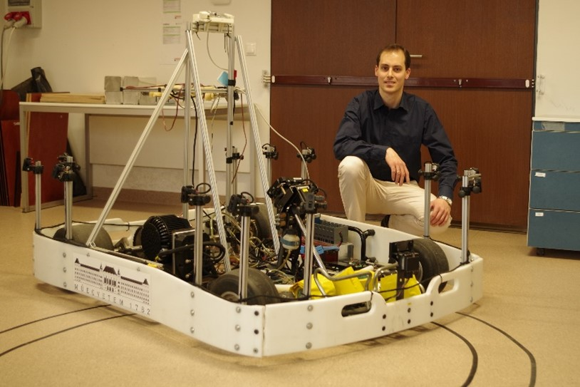

Dr. Németh Balázs a BME Közlekedés- és Járműirányítási Tanszékének címzetes egyetemi docense, oktatási és kutatási területe az önvezető járművek irányítórendszereinek tervezési kérdései. Mérnöki-kutatói hivatása mellett egyben református lelkész.

Az előadás résztvevői megismerkedhetnek a BME KJK és a Mérnökmisszió közös szervezésében megrendezett REFORMula Challenge Innovációs Versennyel, amelynek kiemelt részét képezi az önvezető kisversenyautós program. Szóba kerülnek az önvezető kisjárművek működésének alapjai, illetve a fejlesztések kihívásai. A programot személyes jelenléttel látogatók kipróbálhatnak egy önvezető autóval szembeni versenyzést is.

 <table class="picture">
<tr>
<td>

    
  
Dr. Németh Balázs

</td>
</tr>
</table>
