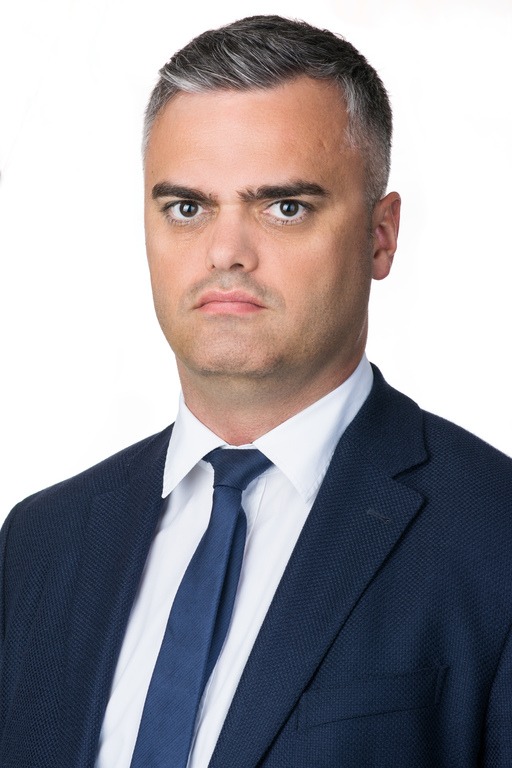

Laboratórium-vezető, egyetemi docens, Nagyfeszültségű Technika és Berendezések Csoport (Villamos Energetika Tanszék · VIK)

 <table class="picture">
<tr>
<td>

    
  
Dr Németh Bálint

</td>
</tr>
</table>
