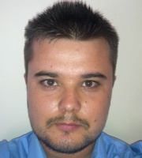

2016-tól a BME Kognitív Tudományi Tanszékének munkatársa. Kutatási területe az arcfelismerés és annak zavarai. Munkája során elektrofiziológiai, viselkedéses és pszichofiziológiai módszereket alkalmaz.

 <table class="picture">
<tr>
<td>

    
  
Németh Kornél

</td>
</tr>
</table>
