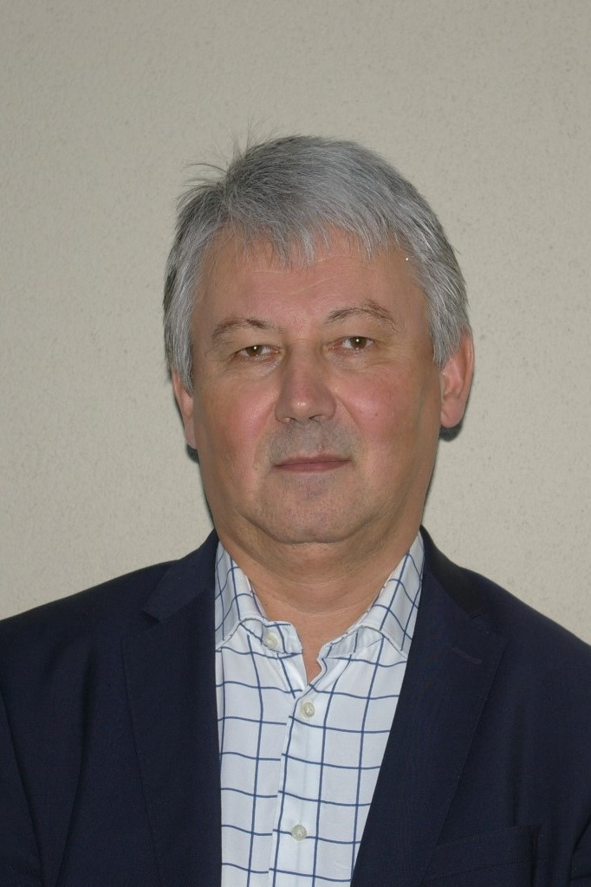

Fizikus, a BME-Nokia 5G Hálózat és 5G Lab K+F tevékenységének koordinátora, az 5G Koalíció 6G Munkacsoportjának vezetője 

 <table class="picture">
<tr>
<td>

    
  
Németh Vilmos

</td>
</tr>
</table>
