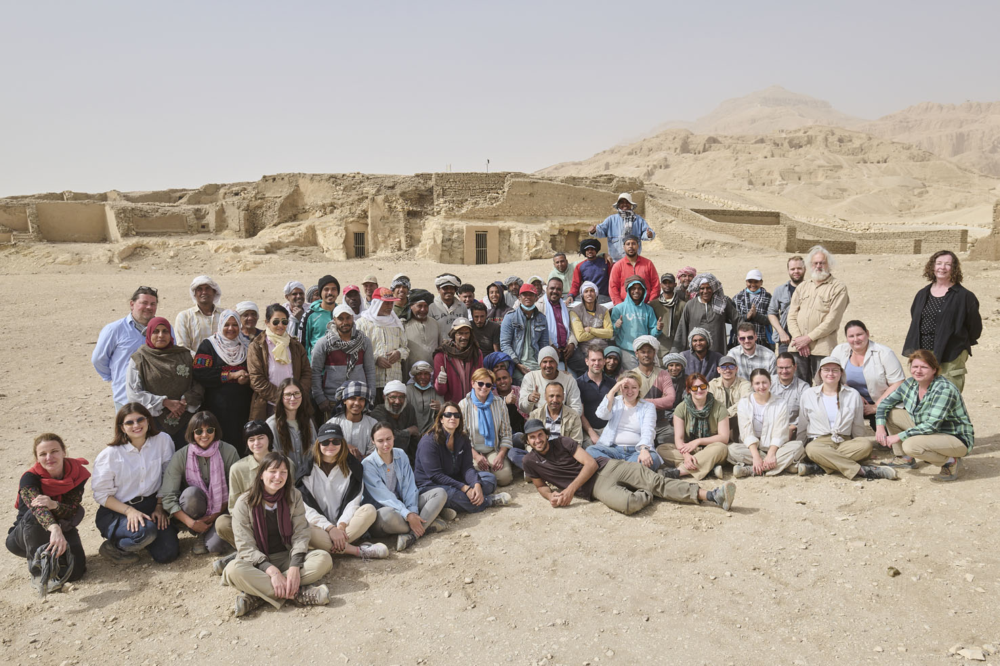

Bernert Zsolt antropológus, Buzár Ágota antropológus, Csehi Eszter Katalin építész, Dávid Dóra DLA építész, Egedi Barbara PhD nyelvész-egyiptológus, Fullér Andrea egyiptológus, Halászné Kapcsándi Szilvia múzeumpedagógus, Hamza Márkó médiatartalom-fejlesztő, Hoór Csilla építész, Koncsos Levente régész, Pálvölgyi Ádám építész, Szigetváry Fanni restaurátor-művészettörténész, Takáts Bendegúz régész-térinformatikus, Tóth Eszter restaurátor, Tóth Tamara építészhallgató, Varga Dániel PhD egyiptológus, Prof. Vasáros Zsolt DLA építész, Zoltai András fotóművész NatGeo Explorer
Együttműködő intézmények, szervezetek: Ministry of Tourism and Antiquities Egypt, Supreme Council of Antiquities Cairo-Egypt, Rare Books and Special Collections Library-The American University in Cairo, BME ÉPK Exploratív Építészeti Tanszék, ELTE Egyiptológiai Tanszék, PPKE Régészettudományi Intézet, Magyar Képzőművészeti Egyetem, Magyar Nemzeti Múzeum, Szépművészeti Múzeum-Magyar Nemzeti Galéria Budapest, Természettudományi Múzeum, Pannonia Reformata Múzeum Pápa, Narmer Építészeti Stúdió, Exploratio Egyesület
Támogatók: NKFIH K.146138, Óbuda Group, Exploratio Egyesület és a Narmer Építészeti Stúdió

<table class="picture">
<tr>
<td>

    
  
A Pecha Kucha est szereplői

</td>
</tr>
</table>
