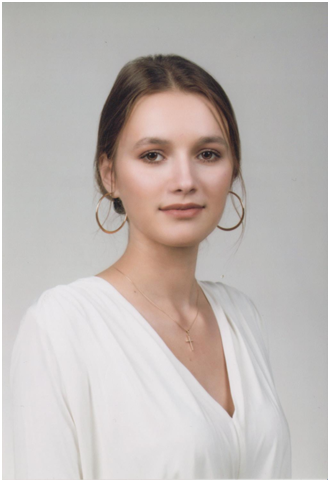

Pelle Rita doktori kutatásának módszertanát és eredményeit mutatja be poszter formájában, a fogászati ergonómia és biomechatronika területéről. A kutatás a fogorvosi munkavégzés testhelyzeteinek biomechanikai elemzésével foglalkozik.
A felvételek marker-alapú és markermentes mozgásrögzítéssel készülnek, az ízületi szögek meghatározása utólagos jelfeldolgozással történik OpenSim és Python környezetben. 
A bemutató a módszertan, az eredmények és a további kutatási irányok áttekintésére nyújt lehetőséget.

 <table class="picture">
<tr>
<td>

    
  
Pelle Rita

</td>
</tr>
</table>
