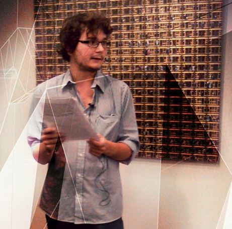

Pintér Gergő matematikus. Minden szinten űzi és tanítja a matekot. Topológia és szingularitáselmélet témában doktorált, jelenleg egy fizikus kutatócsoporttal kvantumrendszerek topológiai jellemzőit
vizsgálja a BME-n. Főleg különböző területek kapcsolódásai érdeklik, a MateMorfózis előadássorozat keretében szórakoztató fesztiválműfajt formált a „felsőbb” matematikából. Két ismeretterjesztő könyve jelent
meg, az [Új világok teremtése című térelmélkedés](https://www.typotex.hu/book/10491/pinter_gergo_uj_vilagok_teremtese) és [A számok rejtett építőkövei: a prímek](https://www.libri.hu/konyv/pinter_gergo.a-szamok-rejtett-epitokovei.html) című sztereotipikus családi dráma.

[Térteremtés (Mindenki Akadémiája) videó>>](https://youtu.be/qzVWZyWg4Ng)

<table class="picture">
<tr>
<td>

    
  
Pintér Gergő

</td>
</tr>
</table>
