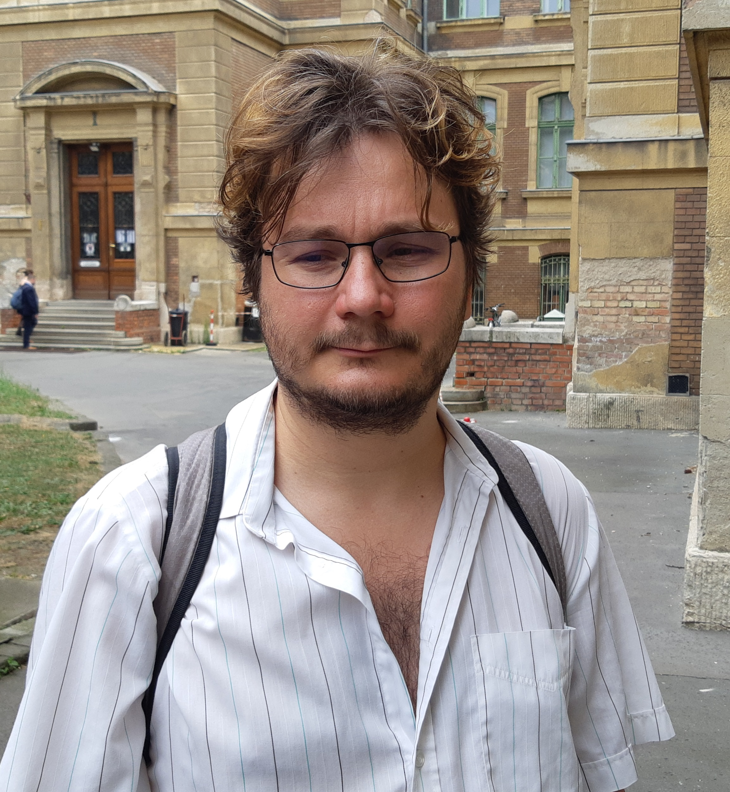

Pintér Gergő matematikus. Minden szinten űzi és tanítja a matekot. Topológia és szingularitáselmélet témában doktorált, jelenleg egy fizikus
 kutatócsoporttal kvantumrendszerek topológiai jellemzőit vizsgálja. Főleg különböző területek kapcsolódásai érdeklik, a MateMorfózis előadássorozat keretében szórakoztató fesztiválműfajt formált a „felsőbb” matematikából. 
Két ismeretterjesztő könyve jelent meg, az [Új világok teremtése](https://www.typotex.hu/book/10491/pinter_gergo_uj_vilagok_teremtese) (geometriai képzetek és képződmények) illetve a [Számok rejtett építőkövei](https://www.libri.hu/konyv/pinter_gergo.a-szamok-rejtett-epitokovei.html) (a prímek). 

<table class="picture">
<tr>
<td>

    
  
Pintér Gergő

</td>
</tr>
</table>
