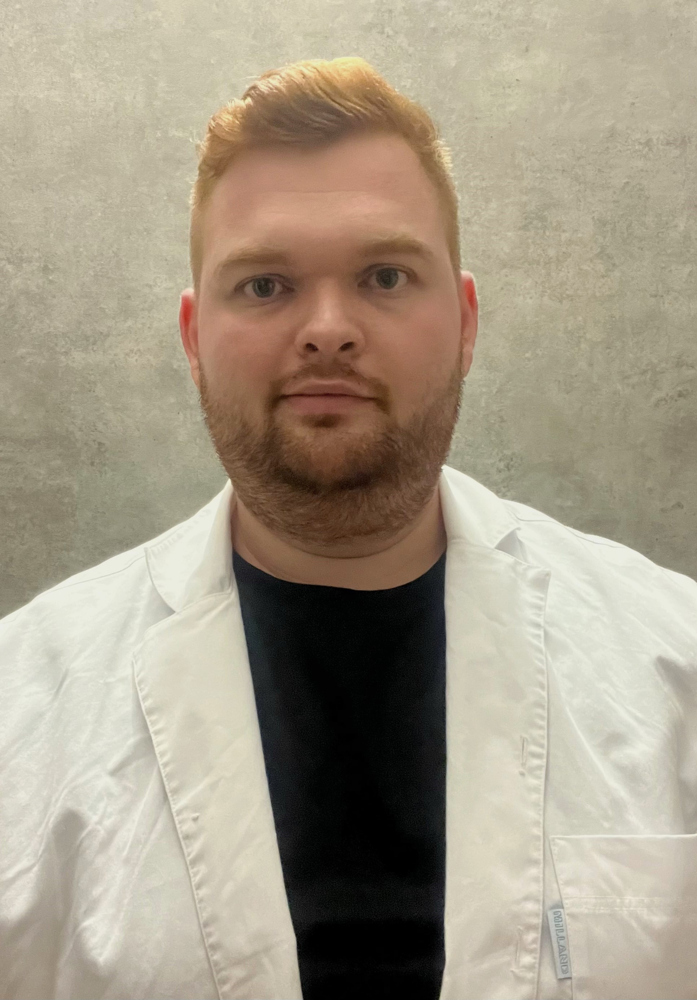

2021-ben harmadéves hallgató korában csatlakozott az ABÉT-en működő Gabonatudományi és Élelmiszerminőség Kutatócsoporthoz. 2019-ben BSc biomérnöki diplomát szerzett, jelenleg MSc-jét vegyészmérnök hallgatóként végzi. Kutatását a csoport reológia területén kezdte, majd kipróbálta magát az immunanalitikai és elválasztástechnikai területeken is. Demonstrátorként segítkezett a Biokémiai laborgyakorlatok során fehérjék izolálása témakörben.

<table class="picture">
<tr>
<td>

    
  
Pisch Barnabás

</td>
</tr>
</table>
