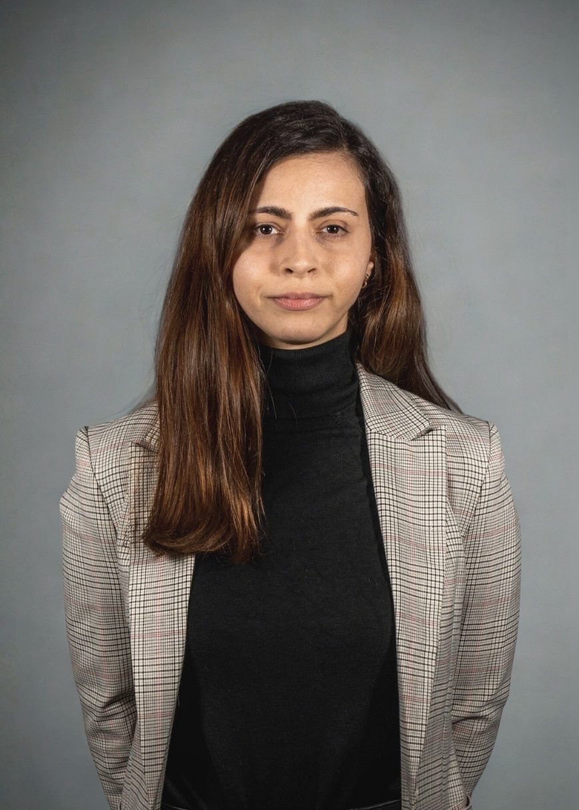

Rabovszky Amanda mesterszakos műszaki menedzser hallgató a termékmenedzsment specializáción. Diplomamunkáját és tudományos diákköri (TDK) dolgozatát a rovaralapú élelmiszerek fogyasztói megítélésének és csomagolásának vizsgálatából írta, a fenntartható élelmiszer-fogyasztás elkötelezett híveként. Kutatásában egy különleges módszert, a conjoint analízist alkalmazta, amelynek segítségével feltárta, hogy a termékek egyes jellemzői milyen szerepet játszanak a fogyasztói preferenciák alakulásában. Kutatási témájával részt vett a 4. EELISA Scientific Student Competition nemzetközi hallgatói tudományos konferencián, valamint a BME GTK Tudományos Diákköri Tanácsa a 38. Országos Tudományos Diákköri Konferencián (OTDK) való részvételre is jelölte.

<table class="picture">
<tr>
<td>

    
  
Rabovszky Amanda

</td>
</tr>
</table>
