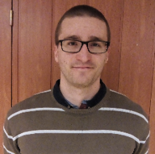

A BME Pszichológia Doktori Iskola hallgatója, a Budapest Sleeplab munkatársa. Kutatási témája az új ismeretek elsajátításának kognitív mechanizmusai. Szabadidejében az agykutatás teljes spektrumának eredményeit próbálja közérthetően kommunikálni (https://agykutatasegyszeruen.org/).

 <table class="picture">
<tr>
<td>

    
  
Reichardt Richárd

</td>
</tr>
</table>
