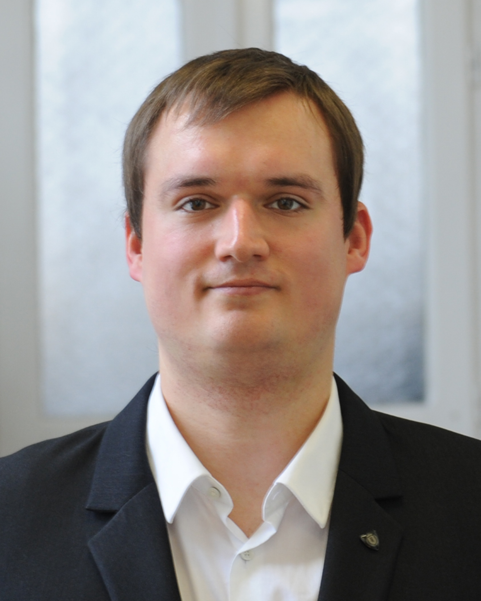

Renkó József Bálint vagyok, a Budapesti Műszaki és Gazdaságtudományi Egyetem doktorandusza, valmint a Gillemot László Szakkollégium szakmai alelnöke. Kutatási területem a nem monoton jellegű alakítási folyamatok vizsgálata, ám emellett előszeretettel foglalkozom izgalmas, elsőre  egyszerűnek tűnő, de a valóságban nagyon komplex anyagtudományi kérdésekkel is. Az itt látható munkákban kollégáimmal közösen készítettünk egy kis ízelítőt az érdeklődnek olyan anyagtudományi kérdésekben, amelyek többségével a háztartásokban is bárki találkozhat. Jó szórakozást kívánok mindenkinek!

 <table class="picture">
<tr>
<td>

    
  
Renkó József

</td>
</tr>
</table>
