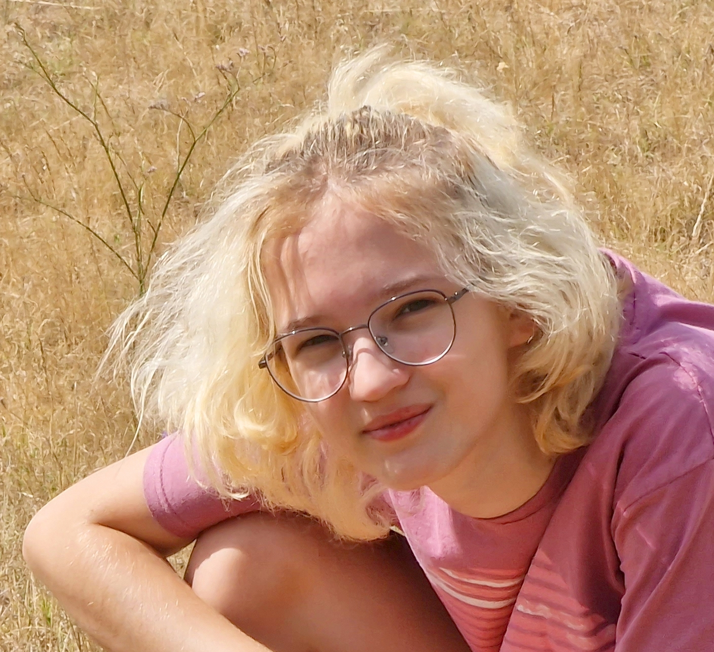

II. Rákóczi Ferenc Gimnázium, Budapest, 12. osztály

Öntevékeny diák kutatási tevékenység: színtévesztés diagnosztika és korrekció népszerűsétése (Orchidea Science Award, 1. helyezés), TDK dicséret

 <table class="picture">
<tr>
<td>

    
  
Samu Sára

</td>
</tr>
</table>
