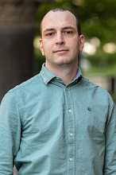

Okleveles gépészmérnök (MSc), jelenleg doktoranduszként dolgozik a HDR Tanszéken. Fő kutatási területét a hemodinamikai kutatások (véráramlás) jelentik.  

<table class="picture">
<tr>
<td>

    
  
Sándor Levente Gábor

</td>
</tr>
</table>
