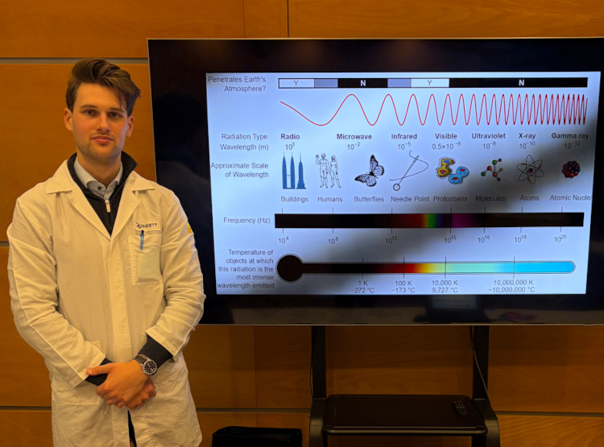

Stift Máté Kálmán a BME Villamosmérnöki és Informatikai Karának doktorandusza, kutatómunkáját az Elektronikai Technológia Tanszéken és a HUN-REN Energiatudományi Kutatóközpontban végzi. Kutatásai során nanométeres vékonyrétegeket, felületeket és érzékelőstruktúrákat vizsgál optikai és elektrokémiai módszerekkel, kiemelten spektroszkópiai ellipszometriával.

 <table class="picture">
<tr>
<td>

    
  
Stift Máté Kálmán

</td>
</tr>
</table>
