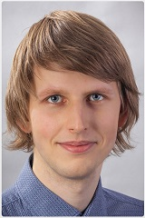

PhD hallgató, kutatási területe a felületszerelési technológia, azon belül is a gőzfázisú forrasztási technológia hőátadásának vizsgálata és a forraszkötésekkel kapcsolatosan kialakuló hibamechanizmusok. Ipari tapasztalata révén jártas a gyártósorokon gyakran felmerülő megoldandó nehézségek területén. 2020-ban elnyerte az Új Nemzeti Kiválóság Program ösztöndíját.

 <table class="picture">
<tr>
<td>

    
  
Straubinger Dániel

</td>
</tr>
</table>
