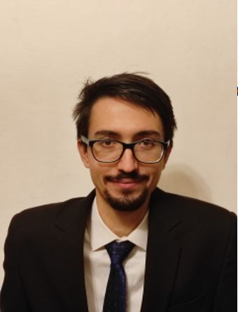

Ph.D. hallgatóként tanul a BME-n, emellett orvosi fizikusként dolgozik az Országos Onkológiai Intézetben. A CT képalkotással a 
mesterképzés során ismerkedett meg közelebbről, az azóta eltelt években pedig beleásta magát a technológiába a képrekonstrukciós algoritmus fejlesztésétől egészen a CT berendezések minőségbiztosításáig.

 <table class="picture">
<tr>
<td>

    
  
Sudár Ákos

</td>
</tr>
</table>
