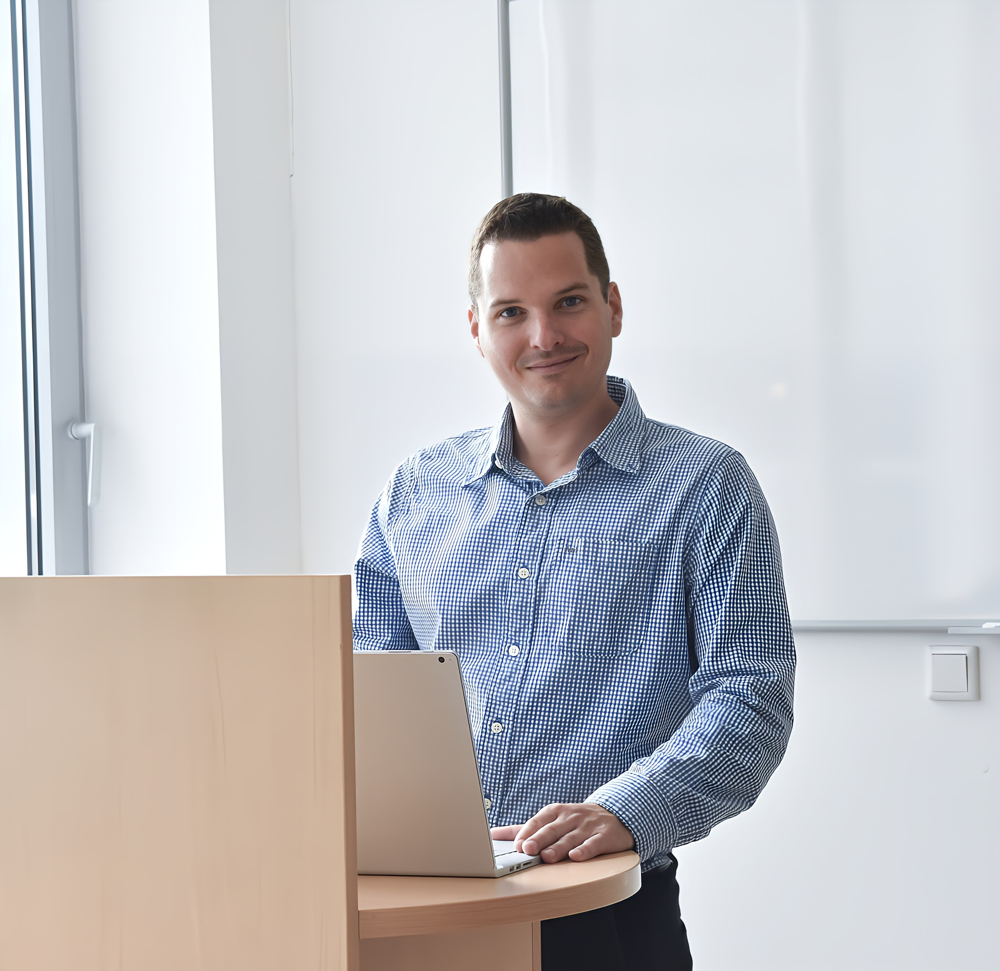

Ember-számítógép interakcióval és ergonómiával foglalkozó oktató és kutató, a BME Ergonómia és Pszichológia Tanszék adjunktusa.

<table class="picture">
<tr>
<td>

    
  
 Dr. Szabó Bálint

</td>
</tr>
</table>
