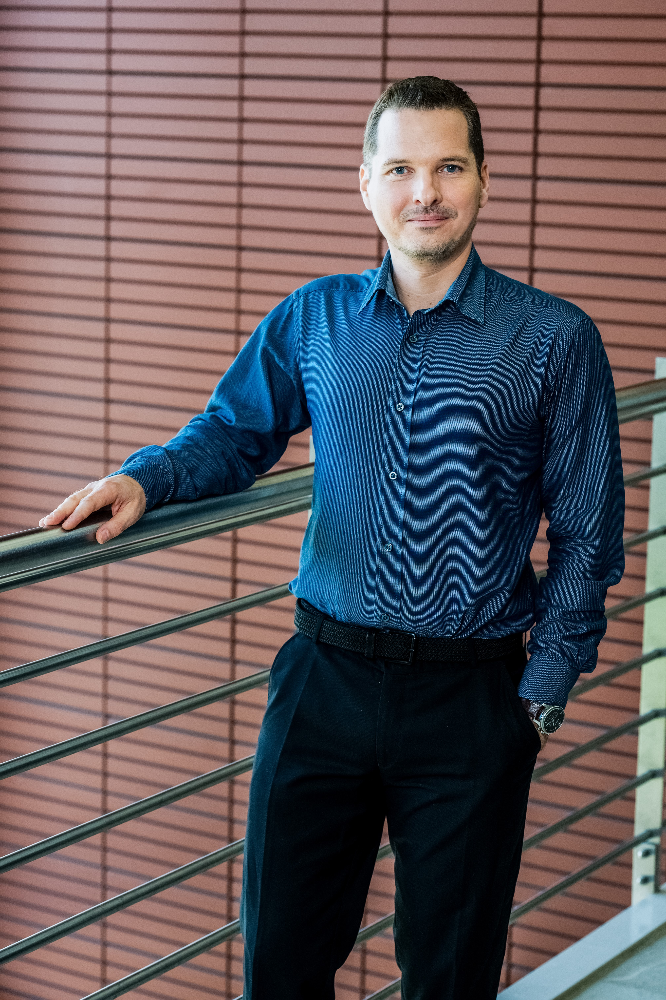

Dr. Szabó Bálint, az Ergonómia és Pszichológia Tanszék adjunktusa, oktatási és kutatási tevékenysége az ember-számítógép interakció tudományterületét fedi le főleg. Többször adott elő a Kutatók Éjszakája programsorozat keretein belül, most viszont a Tanszék legfrisebb kutatási eredményeit és hangulatát bemutató program szervezőjeként van jelen.

<table class="picture">
<tr>
<td>

    
  
Dr. Szabó Bálint

</td>
</tr>
</table>
