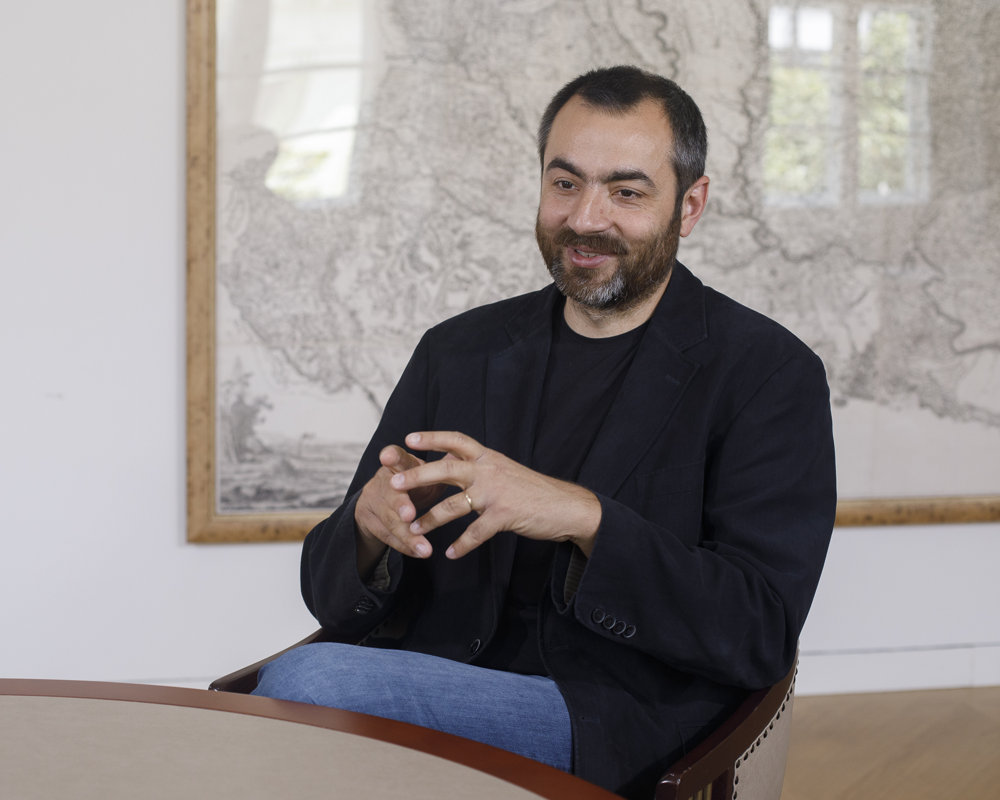

Az előadó egyetemi oktató, építész, számos műemlékrekonstrukció és emlékműprojekt tervezésében vett részt. Kutatásában – szorosan összefonódva alkotói munkásságával – az építészet és emlékezet lehetséges kapcsolatait keresi. Házakat, köztereket tervez, egyetemen tanít, kutat, s mindeközben az építészet csodálatosan izgalmas, időben rétegzett, végtelenül gazdag világát igyekszik minél átfogóbban megismerni és megismertetni.

 <table class="picture">
<tr>
<td>

    
  
Szabó Levente

</td>
</tr>
</table>
