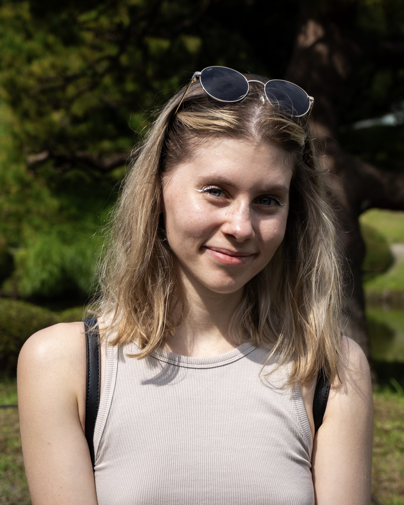

Szalka Panka hatod éves mérnökinformatikus szakos hallgató a BME-n. Több olyan témával foglalkozom, amelyek érdekesek számomra, mint például a kiterjesztett valóság és a gépi látás. Ezt a félévemet Szingapúrban töltöm, amikor pedig szabadidőm engedi szeretek olvasni, festeni és utazni.

 <table class="picture">
<tr>
<td>

    
  
Szalka Panka

</td>
</tr>
</table>
